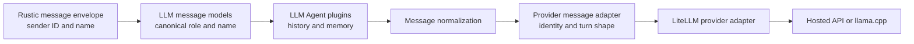

# Speaker-Aware Multi-Model Conversation History

## Status

Proposal.

## Summary

Rustic AI guilds can contain multiple LLM-backed agents that share conversation
history. The canonical history already distinguishes human input, model output,
system instructions, and tool traffic by role, and Rustic messages carry sender
identity. However, provider APIs do not consistently preserve the optional
`name` field used to distinguish multiple participants with the same role.

This proposal preserves truthful roles and participant identity in Rustic AI,
then adapts speaker identity at the LLM provider boundary:

- Human messages remain `user` messages.
- Model and agent responses remain `assistant` messages.
- Results use `tool` only when an agent or function was actually invoked as a
  tool and a valid tool-call relationship exists.
- OpenAI receives native message names.
- Claude and Gemini receive speaker identity inline in message content.
- Persisted history is never rewritten for a particular provider.

The design is implemented primarily in `rusticai-core`, `rusticai-llm-agent`,
and `rusticai-litellm`. Forge only supplies resolver configuration; it requires
no API or blueprint-schema changes. Local Qwen, Gemma, and Granite template
coverage is a separately landable companion project described in
[`LOCAL_LLM_SPEAKER_AWARE_TEMPLATE_DESIGN.md`](LOCAL_LLM_SPEAKER_AWARE_TEMPLATE_DESIGN.md).

## Motivation

In a shared Multi-LLM guild, a request may contain messages such as:

```json
[
  {"role": "user", "name": "Rohit", "content": "Review this conclusion."},
  {"role": "assistant", "name": "Model 1", "content": "The claim is correct."},
  {"role": "assistant", "name": "Model 2", "content": "The claim is incomplete."}
]
```

Changing Model 1 and Model 2 to `user` would make the receiving model treat
their claims as human instructions. Changing them to `tool` would falsely imply
a tool invocation. Keeping both as anonymous `assistant` messages loses
authorship when the provider ignores `name`.

Some providers also normalize conversation shape. Anthropic combines
consecutive messages with the same role into one turn. Without an inline marker,
two adjacent assistant contributions can therefore become one anonymous
assistant turn even before considering whether the API accepts `name`. A marker
must occur at the start of every named contribution so attribution survives
that merge.

The framework therefore needs two distinct representations:

1. A canonical, provider-independent conversation with truthful roles and
   structured participant identity.
2. A temporary provider-facing representation that renders the same identity
   in a form supported by the selected API or local chat template.

This approach is consistent with other multi-agent frameworks. LangGraph, for
example, supports an inline agent-name mode because native AI-message names are
not portable across providers:
<https://langchain-ai.github.io/langgraphjs/reference/functions/langgraph-supervisor.createSupervisor.html>.

## Goals

- Preserve the author of every human and conversational agent message.
- Preserve semantic roles when history crosses model and provider boundaries.
- Support OpenAI, Azure OpenAI, Anthropic Claude, Google Gemini, Vertex AI,
  Bedrock-hosted Claude, and other LiteLLM providers.
- Preserve reasoning, tools, images, audio, documents, and generation prompts.
- Avoid provider-specific logic in guild routes, blueprints, and individual
  agent implementations.
- Keep old guild specifications and custom dependency profiles working.
- Make the final provider input observable and testable.

## Non-Goals

- Migrating Rustic AI from Chat Completions to the OpenAI Responses API.
- Encoding provider or model names into participant identity.
- Treating every agent-to-agent message as a tool call.
- Replacing the Rustic messaging envelope with an LLM-provider schema.
- Requiring every guild to use history enrichment.
- Automatically selecting or changing an agent's model.
- Authoring, packaging, and benchmarking local Qwen, Gemma, and Granite
  templates; that work is covered by the companion local-template design.

## Terminology

**Participant identity** is the stable conversational author, represented by an
agent or user display name with its ID as fallback.

**Model identity** is the provider and model selected by the agent's `llm`
dependency. It can change without changing the participant identity.

**Canonical message** is a Rustic AI `SystemMessage`, `UserMessage`,
`AssistantMessage`, `ToolMessage`, or `FunctionMessage` before provider
adaptation.

**Provider-facing message** is a temporary copy serialized for LiteLLM or a
local OpenAI-compatible endpoint.

## Canonical Role Contract

| Conversation event | Canonical role | Participant identity |
| --- | --- | --- |
| Human input | `user` | User display name, then user ID |
| Agent or model response | `assistant` | Agent display name, then agent ID |
| Agent participating directly in a guild conversation | `assistant` | Sending agent identity |
| Agent explicitly invoked as a tool | `tool` result | Tool protocol identity |
| Function execution result | `tool` or legacy `function` | Function/tool name |
| System instruction | `system` | None |

The following invariants are normative:

- A model response does not become `user` merely because another model reads
  it.
- A model response becomes a `tool` result only when it is causally associated
  with an assistant tool call and valid `tool_call_id`.
- `system`, `tool`, and `function` messages are not assigned conversational
  speaker labels.
- Explicit names supplied by a producer are preserved.
- Missing names use the enclosing Rustic message sender's display name and
  then sender ID.
- Model/provider selection remains outside conversation content.

## Architecture



Provider adaptation belongs in `rusticai-litellm` immediately before
`litellm.completion()` and `litellm.acompletion()`. At that point all LLM agents,
ReAct agents, request preprocessors, memory wrappers, and normalization have
converged on one request, while the selected runtime provider configuration is
still available.

`LLMAgent`, `ReActAgent`, memory stores, guild routes, and blueprints must not
contain Claude- or Gemini-specific branches.

## Configuration Contract

Add the following enum and field to `LiteLLMConf`:

```python
class SpeakerIdentityMode(StrEnum):
    auto = "auto"
    native = "native"
    inline = "inline"
    off = "off"


speaker_identity_mode: SpeakerIdentityMode = SpeakerIdentityMode.auto
```

The modes have these meanings:

| Mode | Name field | Message content |
| --- | --- | --- |
| `native` | Preserved | Unchanged |
| `inline` | Removed before LiteLLM | Speaker marker added to conversational content |
| `off` | Removed before LiteLLM | Unchanged |
| `auto` | Determined by provider/model capability | Determined by provider/model capability |

Bundled dependency profiles must set an explicit mode. `auto` remains useful
for custom profiles and direct use of `LiteLLMResolver`.

Example hosted configuration:

```yaml
llm_anthropic_sonnet:
  class_name: rustic_ai.litellm.agent_ext.llm.LiteLLMResolver
  provided_type: rustic_ai.core.guild.agent_ext.depends.llm.llm.LLM
  properties:
    model: anthropic/claude-sonnet-4-6
    conf:
      speaker_identity_mode: inline
```

Example local configuration:

```yaml
llm_local_qwen:
  class_name: rustic_ai.litellm.agent_ext.llm.LiteLLMResolver
  provided_type: rustic_ai.core.guild.agent_ext.depends.llm.llm.LLM
  properties:
    model: openai/rustic/qwen3.5-2b-balanced
    conf:
      base_url: http://localhost:55262/v1
      speaker_identity_mode: native
```

This setting is runtime resolver configuration. It is snapshotted with the
selected dependency and is not exposed as safe dependency-catalog metadata.
It must be included in every `LiteLLMConf.model_dump()` exclusion used to build
`client_props`; `speaker_identity_mode` is Rustic configuration and must never
be passed to `litellm.completion()` as an unknown keyword argument.

## Provider Capability Policy

| Provider or model path | Default `auto` mode | Rationale |
| --- | --- | --- |
| OpenAI Chat Completions | `native` | OpenAI message schemas support participant names |
| Azure OpenAI | `native` | Uses the OpenAI-compatible message contract |
| Anthropic Claude | `inline` | Claude messages expose roles and content, not arbitrary participant names |
| Claude through Bedrock | `inline` | Same model-facing identity limitation |
| Gemini AI Studio | `inline` | Gemini history uses `user` and `model` roles without a participant-name field |
| Gemini through Vertex AI | `inline` | Same Gemini content contract |
| Verified local speaker-aware template | `native` | llama.cpp passes `name` to the Jinja template |
| Unknown hosted provider | `inline` | Portable, visible identity fallback |
| OpenAI provider with a non-default `base_url` | `inline` | OpenAI-compatible transport does not prove its model template consumes `name` |
| Unknown OpenAI-compatible server | `inline` | Compatible transport does not prove its model template consumes `name` |

Gemini's current native conversation representation is documented as repeated
`Content` entries with `user` and `model` roles:
<https://ai.google.dev/api/generate-content>.

Provider detection should use LiteLLM's resolved provider information where
available, isolated behind a small Rustic AI capability resolver. Bundled
profiles use explicit modes so correctness does not depend on model-name
heuristics. Unknown values produce a debug-level fallback record and use
`inline`. `auto` must inspect both the resolved provider and endpoint: a model
reported as `openai` with a custom/non-default `base_url` is not treated as
native-name-capable unless its profile explicitly selects `native`.

### Provider Turn-Shape Compatibility

Speaker rendering and turn-shape compatibility are two responsibilities of one
provider-message adapter. Canonical roles remain unchanged in persisted history,
but the provider-facing copy must satisfy the selected model's input contract.

Anthropic's general Messages API supports assistant prefill for compatible
models, but Claude Sonnet 4.6 and later reject a final assistant turn with
`400`; Opus 4.6 also does not support assistant prefill. The capability table
must therefore include `supports_assistant_prefill` at the model-family level,
not assume one behavior for every Anthropic model:

- If the provider-facing conversation ends in `assistant` and the selected
  model supports prefill, preserve it.
- If it ends in `assistant` and the selected model does not support prefill,
  preserve that assistant contribution and append a synthetic provider-only
  `user` turn: `Respond to the preceding participant message as the current
  agent.`
- Do not fold the other agent's content into a user message; that would violate
  the canonical role contract.
- Do not persist, route, or show the synthetic continuation turn in the UI.
- Do not append a continuation after an assistant tool call awaiting tool
  results; tool-call sequence validation takes precedence.

Anthropic documents both consecutive same-role merging and general prefill
semantics in its Messages reference:
<https://platform.claude.com/docs/en/api/messages/create>. Model-specific
prefill removals are documented in Anthropic's migration guidance:
<https://platform.claude.com/docs/en/about-claude/models/migration-guide>.

Gemini and Vertex wire tests must determine whether their current adapters
accept a terminal `model` turn. Any required continuation rule belongs in the
same capability table and must not be inferred merely from an OpenAI-compatible
input schema.

## Inline Speaker Encoding

Inline encoding applies only to named `user` and conversational `assistant`
messages. The stable representation is:

```text
Speaker: "Model 1"
The claim is correct under the stated assumptions.
```

Names are serialized as a JSON string after removing C0 control characters,
normalizing CR/LF to spaces, trimming whitespace, and enforcing a bounded
length. JSON encoding prevents a participant name from creating additional
prompt lines or malformed quoting.

The adapter must be a pure transformation:

- Deep-copy the input message list.
- Never modify persisted messages or the original `ChatCompletionRequest`.
- Apply at most once per provider call.
- Remove `name` after inline rendering so unsupported fields do not reach the
  downstream provider.
- Prefix string content directly.
- Insert a text content part before existing multimodal parts.
- Leave unnamed messages unchanged.
- Leave system, tool, and function messages unchanged.
- Leave pure assistant tool-call messages unchanged.
- Preserve assistant content accompanying a normal conversational response.
- Never add labels to `reasoning_content`, thinking blocks, tool arguments, or
  the empty assistant generation prompt.

Retries operate from the canonical request, so speaker markers cannot
accumulate. The implementation must not try to detect previously prefixed user
content by string matching.

`inline` deliberately renders every named conversational contribution. A rule
such as "render only when a role contains two names" would lose attribution in
the common handoff where the receiving model sees exactly one assistant name,
belonging to the preceding agent. Deployments that do not need identity in a
single-agent conversation can select `off` or `native`; the adapter must not
make marker presence depend on changing participant counts.

The marker changes prompt content and token counts. Its deterministic encoding
remains cacheable, but switching a profile between `off`, `native`, and `inline`
changes the cache prefix. Keeping the mode explicit and stable per snapshotted
dependency avoids composition-dependent cache churn.

## Rustic AI Core Changes

The existing core message models already expose optional `name` on system,
user, and assistant messages. Core changes should remain small:

- Document the canonical role and participant-name contract on the models.
- Add shared identity sanitization helpers only if both hosted adaptation and
  local-template tests need a canonical implementation.
- Do not add provider names or transport modes to `ChatCompletionRequest`.
- Preserve backward-compatible parsing of requests without names.
- Keep tool-call validation independent from conversational speaker identity.

## Rustic LLM Agent Changes

`HistoryBasedMemoriesStore` currently reconstructs history from enriched Rustic
messages. It should:

- Name unnamed `UserMessage` instances from the request envelope sender.
- Name the selected historical `AssistantMessage` from the response envelope
  sender.
- Preserve explicit user and assistant names.
- Ignore empty responses safely instead of assuming `choices[0]` exists, both
  while extracting enriched history and in `MemoriesStore.postprocess`.
- Preserve multimodal content when `text_only` is false.
- Rewrite text-only filtering so it never mutates content-part lists while
  iterating and appends each message at most once, even when it contains
  multiple text parts.

The generic memory postprocessing path should assign the current agent's
display name, falling back to agent ID, to an unnamed response before queue,
state, guild-state, or knowledge memory stores retain it. This ensures memories
that do not have a Rustic envelope still preserve authorship.

Knowledge-backed memory should continue storing `role` and `name` as metadata.
Tool messages and assistant tool-call structures should not be recalled without
their complete causal sequence.

### Deduplication

Global `(role, name, content)` deduplication is incorrect because a participant
can legitimately repeat the same statement in a later turn.

The replacement algorithm is:

1. Deduplicate enriched Rustic envelopes by their stable message IDs.
2. Expand each unique envelope into canonical LLM messages in chronological
   order.
3. Detect only exact suffix/prefix overlap between recalled history and the
   current request.
4. Remove the overlapping copy while retaining repeated messages elsewhere.
5. Include role, name, content, tool-call identity, and content-part structure
   in overlap comparison.

No provenance IDs are sent to providers.

## Rustic LiteLLM Changes

Add a `ProviderMessageAdapter` with a pure interface similar to:

```python
def adapt_messages(
    messages: Sequence[LLMMessage],
    mode: SpeakerIdentityMode,
    provider: str | None,
    model: str,
    base_url: str | None,
) -> list[dict]:
    ...
```

`LiteLLM._prep_prompt()` will:

1. Combine configured pre-messages and request messages.
2. Resolve the effective speaker mode.
3. Adapt identity and terminal turn shape on a copy of the messages.
4. Build the LiteLLM request using the adapted dictionaries.
5. Assert Rustic-only configuration fields are absent from the call kwargs.
6. Preserve the actual adapted dictionaries in
   `ChatCompletionResponse.input_messages` for diagnostics.

The synchronous and asynchronous completion paths must call the same method.
The legacy `LiteLLMAgent` path should use the same adapter or be refactored to
delegate request preparation to the shared `LiteLLM` implementation. There
must not be two provider-policy implementations.

`litellm.drop_params` is not an identity strategy. Rustic AI must explicitly
remove unsupported names after rendering them rather than relying on LiteLLM
to silently discard data.

`speaker_identity_mode` must be excluded from `client_props` in both the shared
`LiteLLM` dependency and the legacy `LiteLLMAgent`. A regression test must
capture the kwargs passed to `litellm.completion` and prove the field is absent.

## Local Model Integration Boundary

Local OpenAI-compatible transport does not by itself provide speaker
awareness. A local profile may explicitly select `native` only when its active
chat template is verified to consume `message.name`; otherwise it uses
`inline`. Template authoring, Studio packaging, migration, GGUF selection, and
desktop benchmarking are specified independently in
[`LOCAL_LLM_SPEAKER_AWARE_TEMPLATE_DESIGN.md`](LOCAL_LLM_SPEAKER_AWARE_TEMPLATE_DESIGN.md).

This separation allows canonical identity, hosted provider adaptation, and
memory correctness to land without waiting for local model download and
hardware decisions.

## Forge Changes

Update bundled Forge and Studio dependency profiles with explicit runtime
modes:

| Profile family | Mode |
| --- | --- |
| OpenAI and Azure OpenAI | `native` |
| Anthropic Claude | `inline` |
| Bedrock Claude | `inline` |
| Gemini AI Studio | `inline` |
| Vertex Gemini | `inline` |
| Verified local Qwen/Gemma/Granite | `native`, delivered by the companion project |
| Groq, Cohere, and unverified hosted profiles | `inline` |

The property belongs under resolver `conf`. Forge continues snapshotting the
complete resolver specification selected for each agent. No dependency-catalog
response, guild launch API, blueprint annotation, or database schema changes
are required.

Existing persisted guild snapshots without the field use `auto`. Additive
configuration migrations may insert explicit values into known bundled
profiles but must preserve customized profiles.

## Blueprint Impact

No Multi-LLM blueprint changes are required for provider adaptation. A guild
opts into conversation recall through its existing history-memory plugin and
history enrichment routes. The same blueprint can assign OpenAI, Claude,
Gemini, Qwen, Gemma, or Granite dependencies to different agents.

Agent display names remain stable conversational identities. Model catalog
names must not be substituted for agent names, because an agent can change
models without becoming a different participant.

## Observability

- Keep `ChatCompletionResponse.input_messages` as the actual provider-facing
  messages.
- Add debug logging for resolved provider, configured mode, effective mode,
  and number of rendered names without logging message content.
- Record a warning when an explicit `native` mode is used with a provider known
  not to support names.
- Record a debug event when `auto` falls back to `inline` for an unknown
  provider.
- Never log credentials, base URLs containing secrets, or complete prompts by
  default.
- Preserve canonical history in Rustic messaging so UI and audit views do not
  display provider-specific speaker prefixes.

`input_messages` is diagnostic provider-input data and must not be used by
Studio as conversation content. It includes a full adapted prompt copy, so it
also increases the `ChatCompletionResponse` payload on the message bus. A
follow-up optimization may gate it behind diagnostics or move it to tracing,
but changing that existing behavior is outside this proposal.

System messages are canonicalized before provider adaptation. LiteLLM may hoist
and merge them into Anthropic's top-level `system` value or Gemini's system
instruction, so provider-facing positional fidelity is not guaranteed. The
adapter must not add speaker markers to system content.

## Security Considerations

Participant display names can be user controlled. Name rendering must:

- Normalize newlines and control characters.
- Apply a conservative maximum length.
- Encode the value as a JSON string.
- Never interpolate names into system instructions, tool names, XML element
  names, or provider parameters other than the supported OpenAI `name` field.
- Continue validating native names against provider constraints where
  required.

Inline speaker markers improve attribution but do not create a security
boundary. Models must still treat recalled agent content as potentially
untrusted conversation data rather than system instructions.

Content can imitate the marker. For example, a user can begin a message with
`Speaker: "Model 1"`, producing stacked speaker-looking lines after adaptation,
and a model may reproduce the marker in its own output. The authoritative
identity remains the structured canonical `name`; inline rendering is a model
hint, not an authentication mechanism. Tests must cover marker-like content and
prove the adapter neither strips nor recursively interprets it.

## Test Plan

### Rustic AI Core and Memory Tests

- Name current user messages from sender display name and ID fallback.
- Name recalled assistant messages from their response envelope sender.
- Preserve explicit user and assistant names.
- Preserve roles across multi-model history.
- Leave system, tool, and function messages unchanged.
- Preserve multimodal content.
- Handle empty choices and malformed historical responses safely.
- Do not duplicate a message containing multiple text content parts.
- Preserve repeated identical statements in distinct turns.
- Remove only exact recalled/current boundary overlap.
- Preserve names through queue, state, guild-state, and knowledge memory.

### LiteLLM Unit Tests

- `native` preserves names and content.
- `inline` prefixes named conversational content and removes names.
- `off` removes names without changing content.
- `auto` resolves every supported provider family correctly.
- `auto` resolves `provider=openai` with a custom `base_url` to `inline`.
- String and multimodal content produce equivalent speaker markers.
- Pure assistant tool calls, tool results, reasoning content, and thinking
  blocks are unchanged.
- Input requests are not mutated.
- Sync, async, retry, LLMAgent, and ReActAgent paths do not double-prefix.
- `speaker_identity_mode` never reaches `litellm.completion` kwargs.
- Unsupported-prefill models receive a provider-only terminal user continuation.
- Prefill-capable models preserve intentional terminal assistant input.

### Provider Wire Tests

Use local HTTP test servers to capture LiteLLM's actual outgoing requests:

- OpenAI receives `name` and original `user`/`assistant` roles.
- Claude receives inline names, no unsupported `name`, and assistant content
  remains assistant content.
- Two consecutive named assistant contributions retain separate inline
  attribution after Anthropic combines them into one turn.
- Claude Sonnet/Opus 4.6 provider input never ends on `assistant`.
- Gemini receives `user`/`model` content with inline names.
- Vertex follows Gemini behavior.
- Bedrock Claude follows Anthropic behavior.
- Unknown providers use the documented inline fallback.
- Tool calls and multimodal messages remain schema-valid.

Real hosted smoke tests remain opt-in and run only when their credentials are
available.

### End-to-End Guild Test

Launch a fresh Multi-LLM guild with history enrichment and distinct model
dependencies. Exercise:

1. A human sends a request to Model 1.
2. Model 1 responds.
3. The human tags Model 2 and refers to Model 1's answer.
4. Model 2 receives the human and Model 1 as distinct named participants.
5. Model 2 correctly attributes the prior answer.
6. Repeat across OpenAI, Claude, and Gemini where credentials permit.

Inspect `input_messages`, provider wire captures, Rustic message history, and
the Studio conversation UI. The UI must show canonical conversation payloads,
not diagnostic `input_messages`, and therefore must not show provider prefixes
or synthetic continuation turns.

## Rollout

1. Land canonical role, naming, deduplication, and memory tests in Rustic AI.
2. Land the provider adapter and its mock wire tests in `rusticai-litellm`.
3. Set explicit modes in bundled Forge and Studio dependency profiles.
4. Raise the Forge agent registry/runtime requirement to the first
   `rusticai-litellm` release containing `speaker_identity_mode`; older versions
   use `extra="ignore"` and would silently discard the field.
5. Run the hosted Multi-LLM end-to-end matrix.
6. Document `speaker_identity_mode` for custom dependency profiles.

The initial release should retain an `off` escape hatch. No global rollback is
required because each dependency profile can independently select its mode.

## Acceptance Criteria

- Canonical history retains truthful roles and participant identity.
- Another model's conversational output remains `assistant`, not `user` or
  `tool`.
- OpenAI receives native names.
- Claude and Gemini receive visible inline names without unsupported fields.
- Claude models without assistant prefill never receive a terminal assistant
  turn, while canonical history retains the original assistant role.
- Tool, reasoning, and multimodal flows remain valid.
- Provider adaptation never mutates stored history or request objects.
- Repeated legitimate messages are not globally deduplicated.
- Existing guild specs launch without changes.
- Rustic-only configuration never leaks into LiteLLM call kwargs.

## Open Questions

- Whether future OpenAI Responses API support should reuse this adapter or
  define a separate transport capability contract.
- Whether provider capability resolution should eventually become a general
  `LLM` capability interface shared by non-LiteLLM implementations.
- Whether hosted-provider behavioral attribution tests should run on a nightly
  credentialed pipeline in addition to deterministic wire-contract tests.
