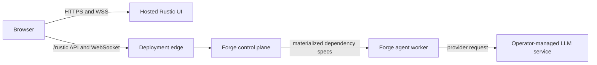

# Rustic UI with External Forge

Rustic UI can be hosted as a static/Node web application while Forge runs as
an independently operated service. In this topology the UI is a client: it
does not launch model servers, read Forge configuration files, or register
dependency profiles.

## Topology and ownership



The deployment operator owns Forge, its dependency configuration, model
services, secrets and OAuth configuration, worker networking, TLS, and access
control. Rustic UI reads the catalog Forge publishes and sends selected
profile keys back during launch.

## Configure the UI

The hosted image writes browser settings to `dist/env-config.js` when its
container starts. Point both Forge URL variables at the same deployment:

```bash
docker run --rm -p 3000:3000 \
  -e RUSTIC_API_BASEPATH=https://forge.example.com/rustic \
  -e API_BASEPATH=https://forge.example.com \
  -e LOGIN_URL=https://login.example.com/ \
  -e LOGIN_APP=rustic-ui \
  rustic-ui
```

- `RUSTIC_API_BASEPATH` is the UI API root and includes `/rustic`.
- `API_BASEPATH` is the Forge server root without `/rustic`.

Forge's UI API must be enabled (`FORGE_ENABLE_UI_API=true`, the default). The
UI reads selectable dependency profiles from:

```text
GET /rustic/dependencies
GET /rustic/dependencies/provided-type/{provided_type}
```

These are read-only catalog endpoints. There is no browser API for registering
or changing dependency profiles.

## Configure Forge dependency profiles

Supply the dependency configuration when Forge starts. An absolute path avoids
working-directory ambiguity:

```bash
forge server \
  --listen :3001 \
  --dependency-config /etc/forge/agent-dependencies.yaml
```

`FORGE_DEPENDENCY_CONFIG=/etc/forge/agent-dependencies.yaml` is the equivalent
environment setting. In distributed mode, give each `forge client` the same
profile definitions with its own `--dependency-config` option so readiness is
evaluated against the same keys.

### OpenAI-compatible service on the deployment network

```yaml
llm_internal:
  class_name: rustic_ai.litellm.agent_ext.llm.LiteLLMResolver
  provided_type: rustic_ai.core.guild.agent_ext.depends.llm.llm.LLM
  catalog:
    display_name: Internal Gemma
    description: OpenAI-compatible model served on the deployment network
    provider: internal
    capabilities: [chat]
    aliases: [gemma, internal]
    selectable: true
  properties:
    model: openai/company/gemma
    conf:
      base_url: http://inference.internal:8080/v1
```

Forge currently loads exactly the profiles declared in the configuration. It
does not probe an arbitrary OpenAI-compatible server and generate profile keys
from `/v1/models`.

### Hosted provider requiring a secret

```yaml
llm_openai:
  class_name: rustic_ai.litellm.agent_ext.llm.LiteLLMResolver
  provided_type: rustic_ai.core.guild.agent_ext.depends.llm.llm.LLM
  catalog:
    display_name: OpenAI GPT-5.4
    provider: openai
    capabilities: [chat, tools]
    aliases: [gpt-5.4, gpt]
    selectable: true
  requirements:
    secrets: [OPENAI_API_KEY]
  properties:
    model: gpt-5.4
```

Configure the selected Forge secret-provider chain and provision the declared
secret for the organization before launch. See [Securing Secrets & OAuth](securing-secrets.md)
for provider and OAuth setup.

## Network reachability

The LLM connection is opened by the spawned agent process, not by the user's
browser. Its endpoint must therefore be reachable from every worker eligible
to run that agent.

`localhost` is relative to the caller's network namespace:

- in single-process Forge with unsandboxed agents, it may refer to the Forge
  host;
- in Docker, it normally refers to the agent container;
- on a remote worker, it refers to that worker;
- in a cluster, it does not refer to the control-plane host.

Use routable service DNS, a cluster service, or an explicitly configured host
gateway for containerized and distributed deployments. Apply egress policy at
the worker or supervisor boundary.

## Deployment security boundary

For an Internet- or enterprise-facing deployment:

- terminate HTTPS and WebSocket TLS at a trusted ingress or reverse proxy;
- authenticate and authorize the UI-facing `/rustic` and WebSocket surfaces at
  that boundary;
- restrict ingress to the intended UI origins and networks;
- keep `/manager/*` private and configure `FORGE_MANAGER_API_TOKEN` for manager
  calls;
- set `FORGE_MANAGER_API_BASE_URL` to the externally reachable Forge root when
  OAuth callbacks are enabled;
- configure `FORGE_OAUTH_PROVIDERS_CONFIG`, the OAuth token store, and the
  secret-provider chain explicitly.

Forge currently emits `Access-Control-Allow-Origin: *`. A deployment requiring
a narrower origin policy must enforce it at the ingress/reverse-proxy layer.
Do not expose an unprotected Forge process directly to the public Internet.

## Desktop is a different topology

Rustic Studio desktop may supervise its bundled Forge and llama.cpp processes.
That desktop-only ownership does not transfer to hosted Rustic UI. See
[Local Desktop Runtime](../use-cases/local-desktop.md) for the single-machine
Forge topology and [Distributed Deployment](distributed-deployment.md) for
worker placement and networking.

